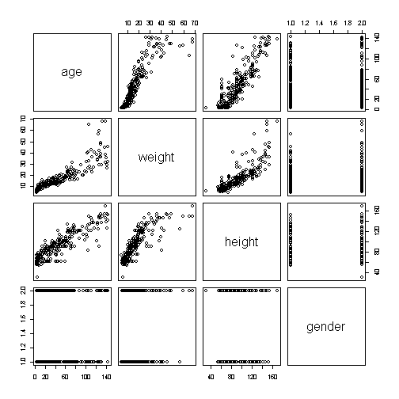

Develop Data Product - Estimating Children Weight
========================================================
author: York Huang
date:   08/07/2016

1. Background
========================================================

This project builds a machine learning model to estimate
children weight based on the following predictors.

- Gender (M/F)
- Height (cm)
- Age    (kg)

2. Data
========================================================

The data comes from a sample of U.S. children from UsingR
package.


```r
library(UsingR)
data('kid.weights')
kid.weights$height = 2.54 * kid.weights$heigh
kid.weights$weight = kid.weights$weight * 0.4536
head(kid.weights)
```

```
  age  weight height gender
1  58 17.2368  96.52      M
2 103 39.4632 109.22      M
3  87 22.6800 121.92      M
4 138 44.4528 154.94      M
5  82 21.3192 119.38      F
6  52 13.6080  60.96      F
```

3. Plot of Data
========================================================


```r
plot(kid.weights)
```



4. Linear Regression Model
========================================================
A linear regression model is built.

```r
library(caret)
model <- train(weight ~ ., data=kid.weights, method='lm')
model$finalModel
```

```

Call:
lm(formula = .outcome ~ ., data = dat)

Coefficients:
(Intercept)          age       height      genderM  
    0.66430      0.20375      0.07313      0.39877  
```

5. Prediction
========================================================

Example:
My son is 96 months old and 125cm high. His kg is 
estimated to be -

```r
newdata = data.frame(age=96, height=125, gender='M')
new_weight = predict(model, newdata = newdata)
print(new_weight[[1]])
```

```
[1] 29.7642
```
